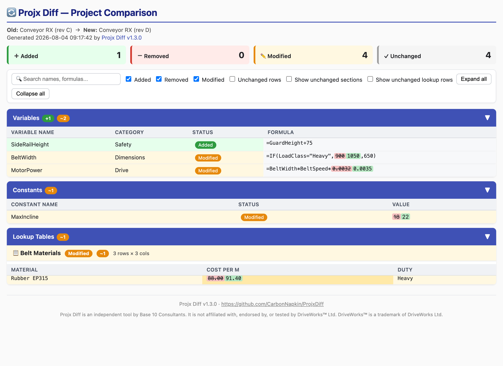
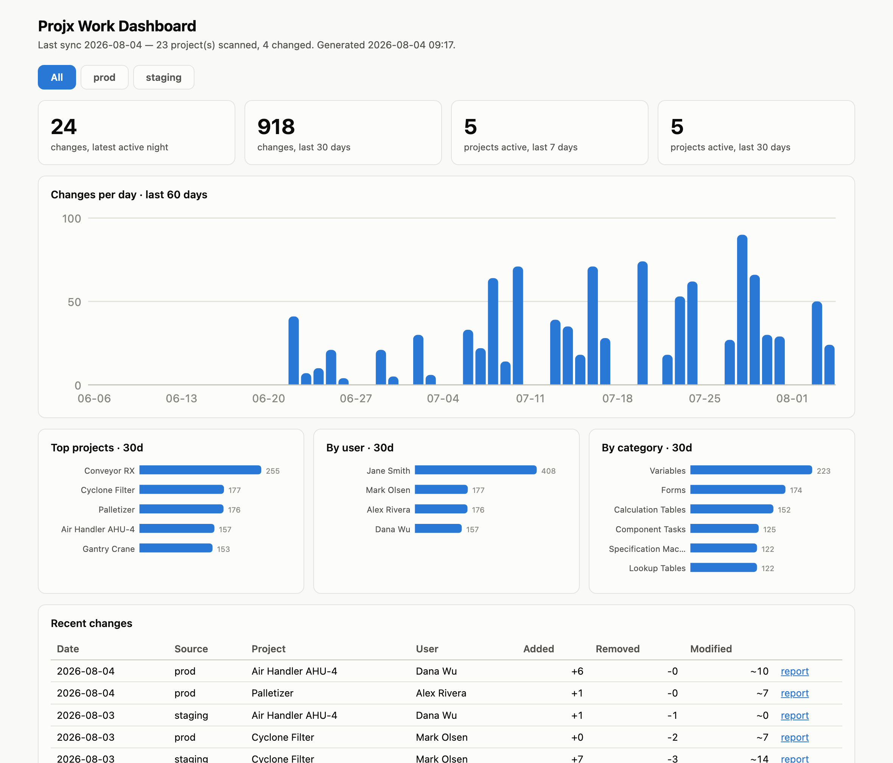

# Projx Diff

A command-line tool to compare two versions of a DriveWorks™ project and generate an interactive HTML report showing all differences.

> **Prefer a desktop app?** Prebuilt macOS and Windows versions (no Python needed) are free at [base10consultants.com/tools/projx-diff](https://base10consultants.com/tools/projx-diff/).



*The nightly sync dashboard — activity trends, per-user attribution, and multi-location tabs (sample data):*



## Features

- **Direct .driveprojx support** - Pass project files directly, no manual extraction needed
- **Recursive scanning** - Finds all project files in nested folders
- **Compares everything** - Variables (with resolved category names), Constants, Special Variables, Calculation Tables (including row-level rules), Component Tasks, Documents, Lookup Tables, Data Tables, Specification Macros (per-task and per-property), Navigation Steps, and Forms (form-level rules plus per-control property formulas)
- **Inline diffs** - See exactly what changed in formulas
- **Interactive filtering** - Filter by Added/Removed/Modified/Unchanged
- **Search** - Find specific variables or formulas
- **Flip direction** - Swap old↔new perspective with one click
- **Auto-detect projects** - Just drop two project files/folders next to the script and run

## Installation

No dependencies required — just Python 3.10+.

```bash
git clone https://github.com/CarbonNapkin/ProjxDiff.git
cd ProjxDiff
```

## Usage

### Graphical UI

Launch a simple file-picker UI (no command line needed):

```bash
python3 -m dw_compare --gui
```

On macOS, double-clicking `run_compare.command` opens the GUI.

### Compare .driveprojx files directly

```bash
python3 -m dw_compare old_project.driveprojx new_project.driveprojx
```

### Auto-detect projects

Place your two projects (folders or .driveprojx files) alongside the package:

```
my-comparison/
├── dw_compare/
├── run_compare.command
├── MyProject_v1.driveprojx    ← old project
└── MyProject_v2.driveprojx    ← new project
```

Then run:

```bash
python3 -m dw_compare
```

The tool recognizes patterns like: `old/new`, `prod/dev`, `v1/v2`, `before/after`, or any two projects.

### Specify folders

```bash
python3 -m dw_compare path/to/old_folder path/to/new_folder -o report.html
```

### Double-click (Mac)

Opens the GUI. After downloading, run once in Terminal:
```bash
chmod +x run_compare.command
```

Then double-click `run_compare.command` to run.

## Command Line Options

```
python3 -m dw_compare [old_project] [new_project] [options]

Arguments:
  old_project         Path to old project folder or .driveprojx file
  new_project         Path to new project folder or .driveprojx file

Options:
  -o, --output FILE     Output file (default: dw_comparison.html / .json)
  -f, --format FORMAT   html (default), json, or both. With both, the JSON
                        lands next to the HTML with a .json extension.
  --no-open             Don't auto-open report in browser
```

### JSON output (for scripting)

`--format json` writes a machine-readable change list instead of the HTML
report — made for pipelines that track project changes over time:

```bash
python3 -m dw_compare old.driveprojx new.driveprojx --format json -o diff.json
```

The document has a versioned schema (`"schema": 1`): a `summary` with
per-category added/removed/modified/unchanged counts, and a flat `changes`
list — one record per changed element (`category`, `name`, `status`, and
field-level `details` with raw old/new formulas). Unchanged elements are
counted but never listed. `--format both` emits the HTML report and the JSON
side by side in one run. JSON-only runs never open a browser.

## Nightly Archive & Change Tracking

The app includes a nightly sync engine (`--sync`) that archives every
`.driveprojx` on a network share into a git repo each night and records what
changed — per project, per category, per element — in a SQLite metrics
database, with per-project HTML/JSON diff reports for drill-down and a
self-contained static dashboard (trends, top projects/users/categories, and
a needs-attention panel) regenerated after every run. Commits are authored
by each project's last DriveWorks saver; a managed census (`--census`, or
the GUI's Tools ▸ Manage Nightly Sync) handles new projects, user identity
mapping (with retroactive metrics healing), and name conflicts.

```bash
python -m dw_compare --sync config.json [--dry-run]
python -m dw_compare --census config.json [--map "Raw=Name <email>"] [--track NAME] [--ignore NAME]
python -m dw_compare --dashboard config.json
```

See [scripts/nightly_sync/README.md](scripts/nightly_sync/README.md) for
setup (Windows Task Scheduler) and the config format.

## Group Database Name Resolution (optional)

Captured models and rule changes reference components by GUID inside the
project file; the human-readable names live in the DriveWorks **group
database** (SQL Server). Point a compare at the group database for each
side and the Models and Rule Changes sections resolve those GUIDs to real
component and model names:

```bash
python3 -m dw_compare old.driveprojx new.driveprojx \
  --old-db-server SQLHOST --old-db-database DWGroup \
  --new-db-server SQLHOST --new-db-database DWGroup
```

Windows integrated auth is the CLI default; for SQL Server logins pass
`--old-db-user`/`--new-db-user` and put the password in the
`DW_SQL_PASSWORD` environment variable (or `DW_SQL_PASSWORD_OLD`/`_NEW`
when the sides differ) — passwords are never accepted on the command line
and never written to disk. Lookups are read-only and fail soft: with no
database (or `pyodbc` missing) the report simply shows raw GUIDs.

In the GUI this lives in a **Database Options** panel that is off by
default — most installs have no group database and never need to see it.
To enable it, add the feature flag to the settings file at
`~/.projxdiff` (`%USERPROFILE%\.projxdiff` on Windows):

```json
{"enable_db": true}
```

Machines that saved a database server before the flag existed keep the
panel automatically; setting `"enable_db": false` hides it regardless.

## Supported File Types

The tool accepts:

- `.driveprojx` - DriveWorks project files (extracted automatically)
- Project folders - already-extracted projects
- `.tdm` - Team Design Master exports

## Project Structure

```
dw_compare/
├── __init__.py      # Package exports
├── __main__.py      # CLI entry point
├── models.py        # Data classes (Variable, Constant, etc.)
├── parsers.py       # Project file parsing
├── comparers.py     # Comparison and diff logic
├── report.py        # HTML report generation
└── jsondiff.py      # Structured (JSON) diff output
```

## Building as Standalone App

End users do not need Python installed. Builds use PyInstaller and the
`dw_compare.spec` file in the project root.

### macOS

```bash
./scripts/build_mac.sh
```

Artifact lands at `dist/ProjxDiff.app`.

### Windows

In PowerShell:

```powershell
.\scripts\build_windows.ps1
```

Artifact lands at `dist\ProjxDiff.exe`.

### Releases

Tag a commit `v1.x.x` and push the tag. The GitHub Actions workflow at
`.github/workflows/release.yml` builds and smoke-tests binaries on the
matching runners — a Windows installer (`ProjxDiff-setup.exe`, Inno Setup,
with Start Menu entry and uninstaller) plus the portable `ProjxDiff.exe`,
`ProjxDiff-macos.zip`, and a `ProjxDiff-linux` binary for headless servers —
then drafts a release with all four attached.

```bash
git tag v1.0.0
git push origin v1.0.0
```

First-run notes:

- On Windows, an unsigned `.exe` triggers a "Windows protected your PC"
  SmartScreen prompt. Click "More info" then "Run anyway". One-time per
  machine.
- On macOS, an unsigned `.app` needs a right-click and Open the first
  time, then choose Open in the dialog. One-time per machine.

## License

MIT

## Disclaimer

Projx Diff is an independent tool from Base 10 Consultants. It is **not
affiliated with, endorsed by, or tested by DriveWorks™ Ltd**. DriveWorks™ is a
trademark of DriveWorks Ltd; it is used here only to describe the file format
that Projx Diff reads.

## Author

[Base 10 Consultants](https://base10consultants.com) - DriveWorks™ Authorized Service Partner